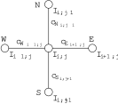

# Anisotropic Filtration

  
  

*Fig. 1: Input image (left); filtered image after 1000 iterations (right).*

In this exercise, we will implement anisotropic filtering of images.

Unlike Gaussian blur, anisotropic filtering smooths an image while preserving sharp edges. The method is based on the physical phenomenon of energy diffusion from regions of higher concentration to regions of lower concentration. In an image, the energy concentration can be represented, for example, by the brightness value of each pixel.

The pixels are arranged on a grid that forms a mesh network. Neighbouring pixels are connected by resistors, and their resistance, or equivalently their conductance, depends on the similarity of the connected pixels. The filtering process evolves over time. In each time step, a small amount of energy flows between neighbouring pixels. The process stops after a predefined number of iterations.

A model of a pixel neighbourhood is shown in Fig. 2. The conductances between neighbouring pixels can be computed as follows:

\\[
\begin{aligned}
c_{N_{i,j}}^{t} &= g \left(\left\|\nabla_N I_{i,j}^{t}\right\|\right) \\\\
c_{S_{i,j}}^{t} &= g \left(\left\|\nabla_S I_{i,j}^{t}\right\|\right) \\\\
c_{E_{i,j}}^{t} &= g \left(\left\|\nabla_E I_{i,j}^{t}\right\|\right) \\\\
c_{W_{i,j}}^{t} &= g \left(\left\|\nabla_W I_{i,j}^{t}\right\|\right) \\, ,
\end{aligned}
\tag{1}
\\]

where \\(g\\) is defined as

\\[
g(\nabla I) = e^{\left(-\frac{\left| \nabla I\right|^2}{\sigma^2}\right)}
\tag{2}
\\]

and \\(\nabla_N I_{i,j} = I_{i,j-1} - I_{i,j}\\). The gradients in the other directions are computed analogously (see Fig. 2).

In each iteration, the new value of a pixel is computed using the following formula:

$$
I_{i,j}^{t+1} = I_{i,j}^{t} \left( 1 - \lambda \left( c_N + c_S + c_E + c_W \right)_{i,j}^{t} \right) + \lambda \left( c_N I_N + c_S I_S + c_E I_E + c_W I_W \right)_{i,j}^{t} \, ,
$$

where \\(I_{i,j}^{t+1}\\) is the new brightness value at coordinates \\((i,j)\\) at time \\(t+1\\), and \\(I_{i,j}^{t}\\) is the brightness value at the same coordinates at time \\(t\\).

Using Eq. (3), compute the new value of every pixel at time \\(t+1\\) from the image values at time \\(t\\). Note that this is **not an in-place operation**: the new values must be written to a separate output image.

For your experiments, use \\(\sigma = 0.015\\) and \\(\lambda = 0.1\\).

*Fig. 2: A model of a pixel at coordinates \\((i,j)\\) with north (\\(N\\)), south (\\(S\\)), west (\\(W\\)), and east (\\(E\\)) neighbours.*

**Hint:** Use the `double` data type to represent the input and output images.
