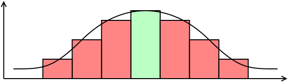

# Edge Thinning and Double Thresholding

In this exercise, we will implement edge thinning followed by double thresholding to obtain clean, one-pixel-wide edges.

## Non-Maximum Suppression

So far, we have used the Sobel operator and other convolution-based operators to detect edges in images. In this exercise, we will instead compute the image derivatives using central differences:

$$
f_x(x, y) = \frac{f(x - 1, y) - f(x + 1, y)}{2}
\tag{1}
$$

and

$$
f_y(x, y) = \frac{f(x, y - 1) - f(x, y + 1)}{2}.
\tag{2}
$$

The resulting edges are typically several pixels wide. Our goal is to reduce them to one-pixel-wide contours. This process is called **edge thinning**, and we will achieve it using **non-maximum suppression**.

Non-maximum suppression removes values that are not local maxima. In other words, a pixel is preserved only if its edge magnitude is greater than the magnitudes of its relevant neighboring pixels.

In a one-dimensional case, a value is retained only if it satisfies

$$
E(x - 1) < E(x) > E(x + 1).
\tag{3}
$$

Thus, the value at position $x$ must be greater than both its left and right neighbors.

  

*Fig. 1: Example of one-dimensional non-maximum suppression. The green bar represents a local maximum and is preserved. The red bars are not local maxima and are therefore set to zero.*

The two-dimensional case is more complex because the neighboring values must be compared in the direction of the edge gradient.

The values $|E_{-\Theta}|$ and $|E_{+\Theta}|$ are therefore computed by linear interpolation of nearby pixel values, as illustrated in Fig. 2.

  

*Fig. 2: An edge and the corresponding gradient values. The diagram uses a Cartesian coordinate system with the origin $(0,0)$ in the bottom-left corner. OpenCV images use the origin in the top-left corner, so adapt the coordinate handling accordingly.*

The interpolated values are computed as

$$
|E_{+\Theta}| =
\alpha |E(x + 1, y + 1)|
+
(1 - \alpha)|E(x + 1, y)|
\tag{4}
$$

and

$$
|E_{-\Theta}| =
\alpha |E(x - 1, y - 1)|
+
(1 - \alpha)|E(x - 1, y)|.
\tag{5}
$$

The current pixel is preserved only if its edge magnitude is greater than the interpolated edge magnitudes on both sides of the edge direction.

## Double Thresholding

After non-maximum suppression, the image contains edge magnitudes only near the centers of detected edges. The next step is to distinguish meaningful edges from small responses caused by noise or minor image variations.

For this purpose, use two experimentally chosen thresholds, $t_1$ and $t_2$, such that

$$
t_2 > t_1.
$$

For each edge magnitude $E(x,y)$:

- if $E(x,y) > t_2$, mark the pixel at $(x,y)$ as a strong edge pixel and set the corresponding output value to $255$;
- if $t_1 < E(x,y) \leq t_2$, treat the pixel as a weak edge pixel;
- preserve a weak edge pixel only if it is connected to a pixel that has already been classified as an edge.

This procedure can be implemented conveniently using a recursive function. Whenever a pixel is classified as an edge, recursively examine its top, bottom, left, and right neighbors and include weak edge pixels that are connected to it.
