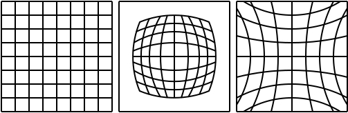

# Removal of Geometric Distortion

  

*Fig. 1: Undistorted image, barrel distortion, and pincushion distortion.*

Barrel and pincushion distortions are examples of **radial distortion**. One of the simplest ways to model these distortions is by transforming image coordinates.

Let $\bar{q} = (x_n, y_n)^T$ represent the undistorted coordinates and $q = (x_d, y_d)^T$ the observed coordinates, i.e. the coordinates in the distorted image. Any radially symmetric distortion can be approximated using a Taylor series of the following form:

$$
\phi(r^2) = 1 + K_1 r^2 + K_2 r^4 + \dots,
\tag{1}
$$

where $r^2 = \bar{x}^2 + \bar{y}^2$, and $K_1$, $K_2$, $\dots$ are the radial distortion coefficients.

To make the coordinates independent of the image dimensions, $\bar{x}$ and $\bar{y}$ are dimensionless. In addition, to preserve radial symmetry, the origin of the coordinate system must be moved to the centre of the image. Coordinates with the required properties can be obtained as follows:

$$
\begin{aligned}
\bar{x} &= \frac{x_n - c_u}{R}, \\
\bar{y} &= \frac{y_n - c_v}{R},
\end{aligned}
\tag{2}
$$

where

$$
R = \sqrt{c_u^2 + c_v^2},
$$

and the coordinates of the image centre are

$$
c_u = \frac{w}{2},
\qquad
c_v = \frac{h}{2},
$$

where $w$ is the image width and $h$ is the image height.

The transformation from the coordinates $(x_n, y_n)^T$ in the reconstructed image to the corresponding coordinates $(x_d, y_d)^T$ in the original distorted image can then be written as

$$
\begin{pmatrix}
x_d \\
y_d
\end{pmatrix}
=
\begin{pmatrix}
x_n - c_u \\
y_n - c_v
\end{pmatrix}
\phi^{-1}(r^2)
+
\begin{pmatrix}
c_u \\
c_v
\end{pmatrix}.
\tag{3}
$$

Process the output image pixel by pixel. For each output pixel $(x_n, y_n)^T$, compute the corresponding coordinates $(x_d, y_d)^T$ in the input image.

In general, the resulting coordinates are real-valued, so an interpolation method must be used to obtain the pixel value. The simplest option is nearest-neighbour interpolation. For better results, use bilinear interpolation.

An example of the result obtained using this method is shown in Fig. 2.

  
  

*Fig. 2: Original distorted image (left); image after removal of radial distortion (right).*
